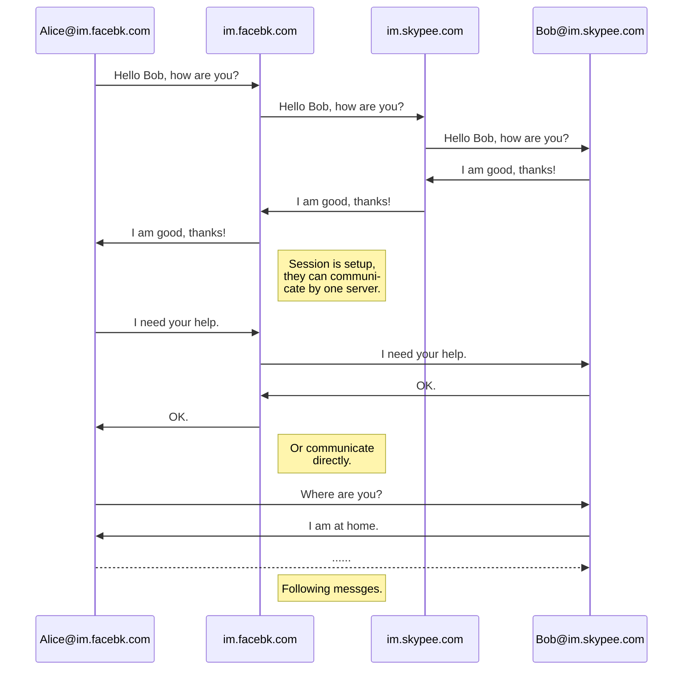

# EMSG - Global, secure and open interconnection Instant messaging communication Scheme

## Overview

EMSG is a global, secure and open, instant Messaging communication scheme. Its functions like a WeChat, Skype, Facebook Messenger that already exists, It provide the short message communication capabilities of such software, but it is implemented in a way that is more similar to the way e-mail is now implemented, using a more secure, an open, distributed, and interconnected implementation solution that enables interconnected messaging services across all instant messaging communications software.

## Function Highlights

### Basic Features

The program contains both the server and the client.

Each user needs to register a personal account in a message server in order to use the account number registered in each message server.

The suffix is the same, the account is different, the format is: username#im.domain.com.

Each user can add more than one friend, the domain name of the friends can be different.

When adding friends it will exchange public keys, when do message communication it is used to decryption and authentication.

The private key is saved on the client itself.

You can use a specific sub-domain name as the account suffix, so that you can find the server directly according to the sub-domain name, do not need MX addressing.

Communication between users is managed in a conversational manner, and messages in a certain time set can be called a session.

When a user sends a message to a friend in a non-session state, he or she needs to connect to his or her own server, according to the sub-domain name of the other account, and then find the other person's server and send a message to the other person's account.

In order to increase communication efficiency, messages within a session do not necessarily have to be transferred through two servers, can be completed separately by the server of the session initiator, if both sides have a public network IP, can be directly communicated without the server.

When the client sends the message, in order to increase the security, it can be encrypted by the other party's public key, signed by its own private key, so that the two sides to carry out an identification, to ensure the security of movement.

Existing instant messaging software, you can develop new interfaces to be compatible with this new protocol, support the addition of this new type of friends, so that the implementation and other communication software interconnection in terms of messaging.

In terms of protocols, separate EMSG protocols can be developed, or protocols such as HTTP, Web sockets, and so on, are currently existing. It is recommended to use currently existing protocols.

Communication diagram:

### Extension Features

Server and client can be implemented in multiple languages, preferably with a variety of open source implementations for use.

Users can build groups, and the group's information is saved on their own servers.

The user's information can be transferred out and transferred to facilitate switching between different operators, when switching requires the new operator to register a new account, then export the old friends and group information, and then import it in the new vendor.

Vendors can develop additional features to provide additional services to users, or they can charge for them.

You can provide the functionality of favorites so that you can save some of the necessary messages in your favorites.

The message for the session is saved by default for a certain number of days, and the expiration is automatically deleted on the client.

If the supplier wants to listen to the information because of the Government's request, it can listen on the client, or on the server, and need to get the customer's key and private key when listening on the server.

Source code Open source client and server, is not to be monitored, can ensure the security of communications.

You can set whether to accept messages from strangers.

Vendors can maximize benefits by adding additional features, analyzing messages, limiting exports, and so on, and can push ads, and so on.

The user's account information can be deleted.

And so on...

## Advantages

Similar to the e-mail way, multi-server nodes, secure, open, interconnect.

There are open source, commercial, breaking the centralized way of messaging services.

Asymmetric encryption, the identity of both sides of each other authentication, to ensure information security.

Personal accounts similar to email addresses are easy to use and can be migrated.

Many apps today have messaging capabilities, but they can only communicate with the same App, a new way to interconnect.

## Summary

EMSG can be used as a new generation of interconnected open and secure instant messaging communication solutions to achieve interconnection and break the current status of communication software can not be connected.

##  Support

[https://github.com/emsg-im/emsg](https://github.com/emsg-im/emsg)

