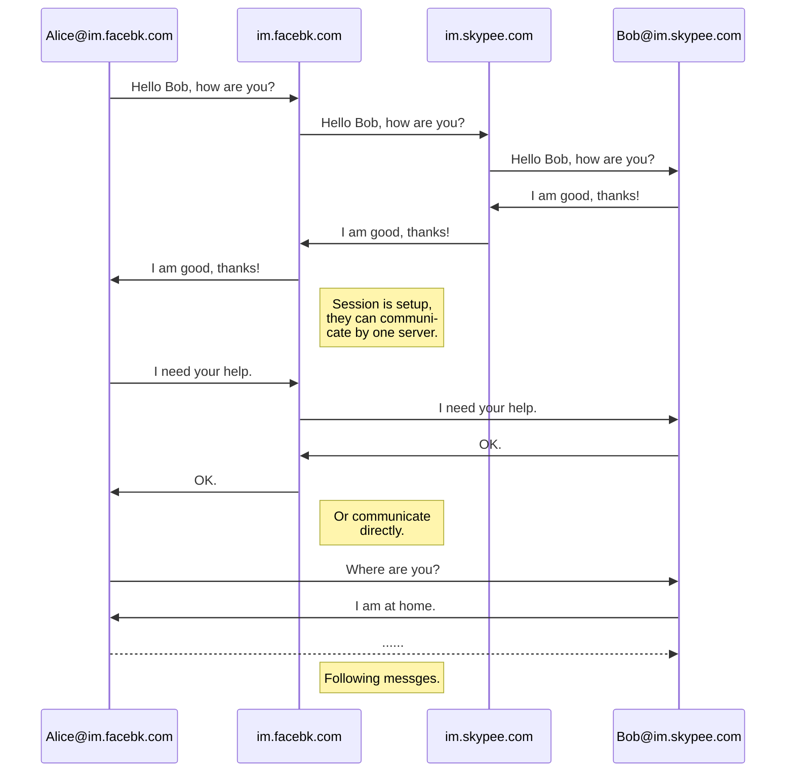

# EMSG - 全球安全开放的互通互联即时消息通信解决方案

## 概要

EMSG是一个全球的、统一、安全、开放的互通互联的即时时消息通信方案，终端功能类似于已经存在的用的微信，Skype，Facebook Messenger这类软件的短消息通信功能，但是它的实现方式更类似于现在已有的电子邮件的这种实现方式，采用更安全的，公开的，分布式的，互通互联的实现方案，让所有即时消息通讯软件之间实现互通互联的消息服务。

## 功能要点

### 基础功能

程序包含服务端和客户端。

每个用户需要在一个消息服务器注册一个个人账号，才能使用，在每个消息服务器注册的账号，后缀是一样的，账号不同，格式为：username#im.domain.com。

每个用户可以添加多个好友，好友的域名可以不同，添加好友时候交换公钥，消息通信时候用来加解密和身份认证。私钥在客户端自己保存。

可以使用特定子域名作为账号后缀，这样直接根据子域名就可以找到服务器，不需要MX寻址。

用户之间的沟通采用会话的方式管理，在一定时间集中的消息都可以称之为一次会话。

用户在非会话状态向好友发送消息的时候，需要连接自己的服务器，自己的服务器根据对方账号的子域名，然后找到对方的服务器，向对方的账号发送消息。

为了增加沟通效率，在一个会话之内的消息，不一定都要经由两个服务器来中转，可以由会话发起方的服务器来单独完成服务，如果双方都有公网ip的话，可以不经由服务器而直接通信。

客户端在发信息的时候，为了增加安全，可以采用由对方的公匙来加密，由自己的私匙来签名，这样对双方进行一个身份确认，保障通行安全。

已经存在的即时消息软件，可以开发新的接口，来兼容这种新的协议，支持添加这种新类型的好友，这样实现和其他通信软件在消息方面互通互联。

协议方面可以开发单独的EMSG协议，或者用当前已经存在的HTTP、Web Socket等协议。推荐使用已有协议。

通信示意图：

### 扩展功能

服务端和客户端可以有多种语言实现，最好有多种开源的实现供使用。

用户可以建群，群的信息保存在自己的服务器上面。

用户的信息可以转出和转入，来方便在不同的运营商之间进行切换，切换的时候需要在新的运营商注册新的账号，然后把旧的好友和群的信息导出，然后在新供应商导入。

供应商可以开发额外附加的功能，来为用户提供额外的服务，也可以收费。

可以提供收藏夹的功能，这样把一些必要的消息可以保存在收藏夹。

会话的消息，默认保存一定的天数，过期会自动在客户端删除。

供应商如果因为政府要求要对信息进行监听的话，可以在客户端监听，也可以在服务端监听，在服务端监听的时候需要拿到客户的公匙和私匙。

源代码开源的客户端和服务端，是不能被监听的，可以保障通信安全。

可以设定是否接受陌生人的消息。

供应商可以通过添加额外的功能，对消息进行分析，限制导出等等来实现利益最大化，可以推送广告等等。

用户的账号信息可以注销。

等等。。。

## 优点

类似于邮件的方式，多服务器节点，安全，公开，互通互联。

有开源的，有商业的，打破集中式的消息服务方式。

非对称加密，双方身份互相认证，保证信息安全。

类似邮件地址的个人账号，使用方便，可以迁移。

当前很多App都有消息功能，但都只能相同App间通讯，这种新方式可以实现互通互联。

## 总结

EMSG可以作为新一代的互通互联、开放、安全的即时消息通讯解决方案，实现互通互联，打破当前通信软件之间不能通联的现状。

##  支持

[https://github.com/emsg-im/emsg](https://github.com/emsg-im/emsg)

